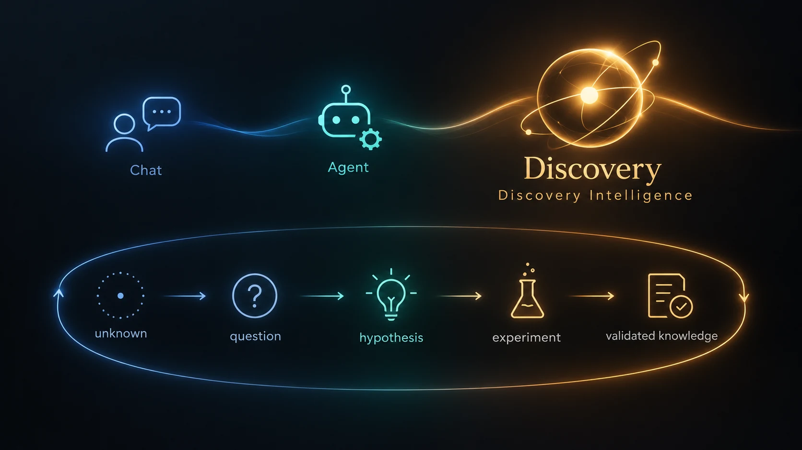

# Discovery Foundation Models

### Discovery Intelligence · Research & Open Source

**English** · [中文](README_CN.md) · [Website](https://phai-labs.com/) · [Technical Report](#technical-report) · [Research Progress](#research-progress) · [Scientist Collaboration](https://phai-labs.com/collaborate/)

**From answering questions and executing tasks to discovering what comes next.**

Discovery Foundation Models (DFMs) explore how AI can identify valuable unknowns, formulate problems, construct representations and hypotheses, gather external evidence, and improve its ability to discover across tasks.

Initiated by **[PhAI Labs](https://phai-labs.com/)**, this repository brings together the DFM technical report, research map, project announcements, and links to open research. **Individual research projects will be developed and released in their own repositories.** DFM-Plans maintains the overview, milestones, and navigation to those projects.

  

*Discovery Intelligence: from Chat and agents to a recursive discovery loop.*

## Technical Report

**Discovery Foundation Models** — arXiv link forthcoming.

The report organizes seven core capabilities: **Problem Discovery, Problem Formulation, Representation Construction, Hypothesis Formation, Intervention & Experimentation, Evidence-Grounded Revision, and Continual Discovery Improvement**.

Its reference architecture, **Zetema**, explores how explicit research states, memory, tools, experimental environments, verification, and human oversight can support a recursive discovery loop. It is a research design; implementation and validation progress will be reported through the linked projects.

## Research Progress

From **Chat** to **Code** to **Discovery Intelligence**, AI learns from knowledge, action outcomes, and scientific inquiry. Our work builds the scientific data, environments, and feedback needed to support this transition.

| Direction | Project | Research focus | Planned introduction | Resources |
| --- | --- | --- | --- | --- |
| **Scientist Interaction** | **ScienceBuddy** | Scientist dialogue, research feedback, and continual improvement | September 16, 2026 | [Overview](sciencebuddy/) · [GitHub](https://github.com/Gen-Verse/ScienceBuddy) |
| **Scientific Environments** | **ScienceIDE** | Executable, verifiable, and reusable scientific environments for agent execution and model training | September 17, 2026 | [Overview](scienceide/) · [GitHub](https://github.com/Gen-Verse/ScienceIDE) |
| **Scientific World Models** | **JEPA Anything** | Scientific state representations and prediction of changes under interventions across domains | September 18, 2026 | [Overview](jepa-anything/) · [GitHub](https://github.com/Gen-Verse/JEPA-Anything) |

The projects connect **interaction feedback, reusable environments, and world-state prediction** within the broader DFM research agenda. Each is developed, evaluated, and released independently; scientific data and discovery reasoning are shared research themes.

**Current status:** public repository releases are forthcoming. The dates above refer to planned research introductions. Papers, code, models, datasets, demos, and subsequent milestones will be linked here as they become available, with technical details maintained in each project's repository.

## Scientist Collaboration

We welcome scientists, research teams, and experimental platforms with important open questions, scientific data, executable environments, or opportunities for real-world validation.

- **[Apply to the DFM Scientist Collaboration Program](https://ecnxosgyafi8.feishu.cn/wiki/Z1A2wr23ViqAOBkq3xfcgfl7nZg?table=tblboSz1SkRQ0iM2&view=vewoiUIlNk)**
- **[DFM Scientist Collaboration Program — Overview](https://phai-labs.com/collaborate/)**

## Developer Navigation & Index Updates

- Follow each project's repository for code, installation, technical questions, issues, and contributions.
- Use [Issues in this repository](https://github.com/Gen-Verse/DFM-Plans/issues) to suggest a project for inclusion, correct a link, or discuss the overall research map.
- Read [CONTRIBUTING.md](CONTRIBUTING.md) to submit an index or milestone update.

## Citation & Contact

For research use, cite the relevant technical report or individual project paper. Citation details will be linked as those resources become available.

**PhAI Labs** · [Website](https://phai-labs.com/) · [yang@phai-labs.com](mailto:yang@phai-labs.com)
