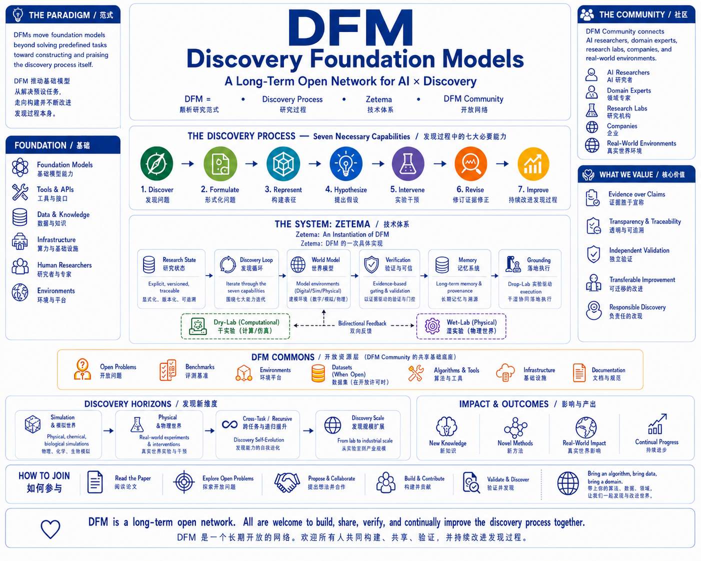

# Discovery Foundation Models

### A Long-Term Open Network for AI × Discovery

> **Connecting frontier AI, domain expertise, and real-world discovery.**

[中文](README_CN.md) · [Open Problems](OPEN_PROBLEMS.md) · [Collaborate](COLLABORATE.md) · [Roadmap](ROADMAP.md) · [Contributing](CONTRIBUTING.md)

**Contact:** [yang@phai-labs.com](mailto:yang@phai-labs.com) — research collaboration, domain partnerships, industry partnerships, and funded projects.

<p align="center">
  
</p>

<p align="center">
  <em>DFM Paradigm → Zetema System → DFM Community</em>
</p>

---

## About

**Discovery Foundation Models (DFMs)** aim to move foundation models beyond solving predefined tasks toward **open-ended discovery**: discovering valuable problems, constructing and revising representations, forming testable hypotheses, designing informative interventions, revising under external evidence, and continually improving discovery itself.

**DFM Community** is the long-term network around this vision. It connects **AI researchers, domain scientists, infrastructure builders, research labs, companies, and real-world environments**.

**DFM Commons** is the open resource layer built by the community: algorithms, infrastructure, environments, benchmarks, datasets, open problems, and reproducible research artifacts.

> **Paper defines it. Zetema builds it. DFM Community expands it.**

---

## What We Support

For substantial contributions and important research directions, we actively support:

- **Research collaboration & publication** — including flagship DFM work, independent research tracks, and potential collaborations with appropriate leading journals, companion journals, conferences, and interdisciplinary projects.
- **Research funding** — including compute, engineering support, dataset construction, simulation, annotation, experimental expenses, and wet-lab costs.
- **Academic & real-world partnerships** — from open research to joint R&D, domain challenges, pilot studies, and deployment-oriented validation.
- **Founding Contributor recognition** for major early contributors to the DFM Community.

Authorship, publication, and research credit are always based on actual contribution and normal independent peer review.

---

## What Is a DFM?

Most foundation models begin after humans have already specified the problem, representation, objective, tools, and evaluator. **Discovery starts earlier.**

We formulate DFM around seven coupled capabilities:

**Problem Discovery → Problem Formulation → Representation Construction → Hypothesis Formation → Intervention & Experimentation → Evidence-Grounded Revision → Continual Discovery Improvement**

Our goal is to make discovery **learnable, executable, externally grounded, and systematically evaluable**.

---

## How to Join

### Build the Intelligence

Work on discovery agents, scientific RL, post-training, representation construction, intervention design, failure attribution, world models, process-level scaling, and continual discovery skills.

### Build the Infrastructure

Build research-state systems, branching and rollback, memory, provenance, tools, environments, verification, experimental gating, Dry/Wet-Lab interfaces, and evaluation infrastructure.

### Bring a World

You do not need to be an AI researcher. We welcome experts from biology, chemistry, materials, medicine, robotics, physics, mathematics, climate, engineering, social science, and beyond.

Contribute **scientific problems, data, simulators, benchmarks, experimental environments, protocols, validators, wet-lab access, or domain expertise**.

> **Bring an algorithm. Bring infrastructure. Bring a domain. Bring a real problem.**

---

## Repository Map

The repository is organized as the full DFM research stack from system foundations to real-world discovery:

```text
DiscoveryModels/
├── paper/          # DFM definition and paper snapshot
├── zetema/         # Reference DFM system organization
├── training/       # Capability formation and scientific post-training
├── environments/   # Digital, simulation, and physical grounding
├── evaluation/     # Process, transfer, efficiency, and controls
├── benchmarks/     # Discovery-oriented benchmark development
├── data/           # Trajectories, interactions, and domain data
├── domains/        # AI × scientific / engineering domain tracks
├── examples/       # Reproducible demos and discovery traces
├── docs/           # Extended documentation
├── community/      # DFM Community, partners, and funded challenges
└── discoveries/    # Future externally validated discovery records
```

Many directories are intentionally visible before their first release so the community can see the **full research map** and join early. Each directory README states its scope and current status.

---

## Open Research Map

We organize open problems across the seven DFM capabilities and four research horizons:

**Digital → Simulation-Grounded → Physical → Recursive**

Every intersection may require new:

**Algorithms × Infrastructure × Environments × Benchmarks × Domains**

See [`OPEN_PROBLEMS.md`](OPEN_PROBLEMS.md) for the initial research agenda.

---

## What We Will Open Source

We will progressively release:

- DFM / Zetema infrastructure
- discovery algorithms and training recipes
- scientific RL and process supervision
- research environments and benchmarks
- evaluation protocols
- Discovery Skill Memory
- domain-specific practices and lessons

This is a progressive research effort, not a one-time code dump.

---

## Open, but Not Uncurated

DFM Community is open to participation while maintaining high scientific standards. We value:

**Reproducibility · Provenance · External Grounding · Falsification · Independent Validation · Transfer**

A contribution should be judged by **what it enables and what survives validation**. Negative results, counterexamples, failed replications, and challenges to the current DFM framework are also valuable contributions.

> **Open to everyone. Promoted by evidence.**

### Discovery is too broad for any single lab.

**Help us build the Discovery Network.**
