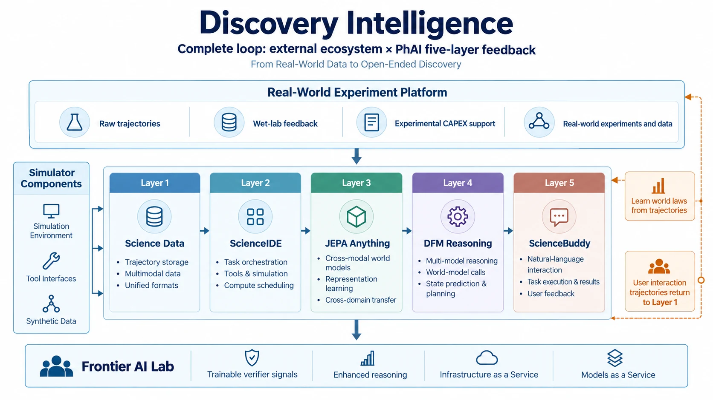
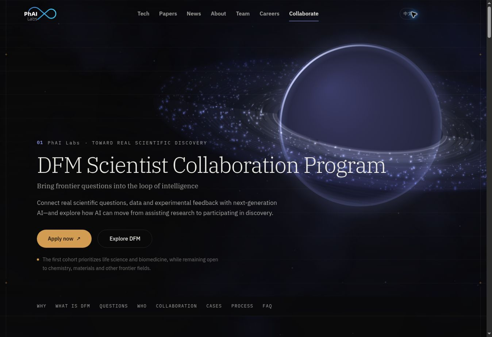

# Discovery Foundation Models

### Discovery Intelligence · Research & Open Source

**English** · [中文](README_CN.md) · [Website](https://phai-labs.com/) · [Technical Report](https://arxiv.org/abs/2609.15973) · [Research Progress](#research-progress) · [Scientist Collaboration](https://phai-labs.com/en/collaborate/)

**From answering questions and executing tasks to discovering what comes next.**

Discovery Foundation Models (DFMs) explore how AI can identify valuable unknowns, formulate problems, construct representations and hypotheses, gather external evidence, and improve its ability to discover across tasks.

Initiated by **[PhAI Labs](https://phai-labs.com/)**, this repository brings together the DFM technical report, research map, project announcements, and links to open research. **Individual research projects will be developed and released in their own repositories.** DFM-Plans maintains the overview, milestones, and navigation to those projects.

<p align="center">
  
</p>

*Discovery Intelligence architecture: external experiments, five-layer collaboration, and a closed feedback loop.*

## Technical Report

**[Discovery Foundation Models: Toward Open-Ended Discovery Intelligence](https://arxiv.org/abs/2609.15973)** — Technical Report.

The report organizes seven core capabilities: **Problem Discovery, Problem Formulation, Representation Construction, Hypothesis Formation, Intervention & Experimentation, Evidence-Grounded Revision, and Continual Discovery Improvement**.

Its reference architecture, **Zetema**, explores how explicit research states, memory, tools, experimental environments, verification, and human oversight can support a recursive discovery loop. It is a research design; implementation and validation progress will be reported through the linked projects.

## Research Progress

From **Chat** to **Code** to **Discovery Intelligence**, AI learns from knowledge, action outcomes, and scientific inquiry. Our work builds the scientific data, environments, and feedback needed to support this transition.

| Direction | Project | Research focus | Release / plan | Resources |
| --- | --- | --- | --- | --- |
| **Scientist Interaction** | **[ScienceBuddy](sciencebuddy/README.md)** | Interactive scientific workspace with recursive-in-recursive improvement of agent harnesses and models | Released · 2026-09-16 | [Paper](https://arxiv.org/abs/2609.17523) · [Code](https://github.com/Gen-Verse/ScienceBuddy) · [Product](http://science-buddy.io/) |
| **Scientific Environments** | **[ScienceIDE](scienceide/README.md)** | Scientific code transformed into executable, verifiable learning environments for SFT, RL, and evaluation | Released · 2026-09-17 | [Paper](https://arxiv.org/abs/2609.19134) · [Code](https://github.com/aitofound/ScienceIDE) · [Models](https://huggingface.co/collections/AItonomy/scienceide-model-series) |
| **Scientific World Models** | **[JEPA-Anything](jepa-anything/README.md)** | Scientific state representations and prediction of changes under interventions across domains | Released · 2026-09-18 | [Paper](https://arxiv.org/abs/2609.20800) · [Code](https://github.com/Gen-Verse/JEPA-Anything) |

The projects connect **interaction feedback, reusable environments, and world-state prediction** within the broader DFM research agenda. Each is developed, evaluated, and released independently; scientific data and discovery reasoning are shared research themes.

**Current status:** ScienceBuddy has released its preview workspace, paper, and research code. ScienceIDE has released its paper, preview code, selected environments and tasks, and the PhAI-IDE-4B, 9B, and 72B model series. Ongoing training and evaluation infrastructure development is maintained in [ScienceInfra](https://github.com/Gen-Verse/ScienceInfra). JEPA-Anything has released its paper and research code. Technical documentation and subsequent releases are maintained in each project's repository.

## Scientist Collaboration

<p align="center">
  <a href="https://phai-labs.com/en/collaborate/">
    
  </a>
</p>

We welcome scientists, research teams, and experimental platforms with important open questions, scientific data, executable environments, or opportunities for real-world validation.

- **[Apply to the DFM Scientist Collaboration Program](https://ecnxosgyafi8.feishu.cn/wiki/Z1A2wr23ViqAOBkq3xfcgfl7nZg?table=tblboSz1SkRQ0iM2&view=vewoiUIlNk)**
- **[DFM Scientist Collaboration Program — Overview](https://phai-labs.com/en/collaborate/)**

## Developer Navigation & Index Updates

- Follow each project's repository for code, installation, technical questions, issues, and contributions.
- Use [Issues in this repository](https://github.com/Gen-Verse/DFM-Plans/issues) to suggest a project for inclusion, correct a link, or discuss the overall research map.
- Read [CONTRIBUTING.md](CONTRIBUTING.md) to submit an index or milestone update.

## Citation & Contact

If you find this work useful, please cite the DFM technical report. When using an individual project, please also cite its associated paper.

```bibtex
@article{yang2026discovery,
  title={Discovery Foundation Models: Toward Open-Ended Discovery Intelligence},
  author={Yang, Ling and Yin, Zhenfei and Wu, Yingcheng},
  journal={arXiv preprint arXiv:2609.15973},
  year={2026}
}

@article{xue2026sciencebuddy,
  title={ScienceBuddy: Recursive-in-Recursive Self-Improvement for Interactive Scientific Agents},
  author={Xue, Shuhan and Zhong, Jianyuan and Nan, Ziyuan and Li, Wenbin and Yu, Zhaochen and Ding, Jinchao and Gao, Qiang and Zhan, Pengyu and Zhang, Yuntong and Cheng, Tian and Yin, Zhenfei and Wu, Yingcheng and Yang, Ling},
  journal={arXiv preprint arXiv:2609.17523},
  year={2026}
}

@article{geng2026scienceide,
  title={ScienceIDE: Turning World's Scientific Codebase into Agent Learnable Environments},
  author={Geng, Hejia and Huang, Zesen and Li, Haoyang and Li, Wenbin and Wu, Koutian and Zhou, Zihan and Pang, Yuanbo and Liu, Weihao and Xu, Zigong and Li, Zhiping and Zhang, Zongzheng and Dong, Chuanfei and Sun, Jiankai and Zheng, Tianzhe and Xie, Fengyu and Ma, Yue and Shi, Yueheng and Xie, Tong and Di, Zonglin and Liu, Xianrong and Gao, Qucheng and Liu, Yimin and Pan, Jiaming and Huang, Sheng and Ma, Xiao-Han and Yuan, Lanqing and Zhu, Zhenlin and Liu, Ziang and Xu, Ziyang and Wang, Junkai and Liang, Kangkai and Xian, Jiayi and Zhao, Zehong and Xu, Liuwei and Xie, Jingxu and Zhang, Peijin and Gao, Qiang and Xing, Chengyi and Zhao, Zhe and Wang, Xi and Xing, Yaopeng and Meng, Xing and Yin, Zhenfei and Wu, Yingcheng and Yang, Ling},
  journal={arXiv preprint arXiv:2609.19134},
  year={2026}
}

@article{cui2026jepaanything,
  title={JEPA-Anything: Learning Predictive Models across Different Worlds},
  author={Cui, Taoyong and Wang, Zhongyao and Xu, Xinyue and Liu, Weiyang and Yu, Zhaochen and Zhang, Yuying and Gao, Qiang and Yang, Mengyue and Ouyang, Wanli and Heng, Pheng Ann and Wu, Yingcheng and Yin, Zhenfei and Yang, Ling},
  journal={arXiv preprint arXiv:2609.20800},
  year={2026}
}
```

**PhAI Labs** · [Website](https://phai-labs.com/) · [yang@phai-labs.com](mailto:yang@phai-labs.com)
