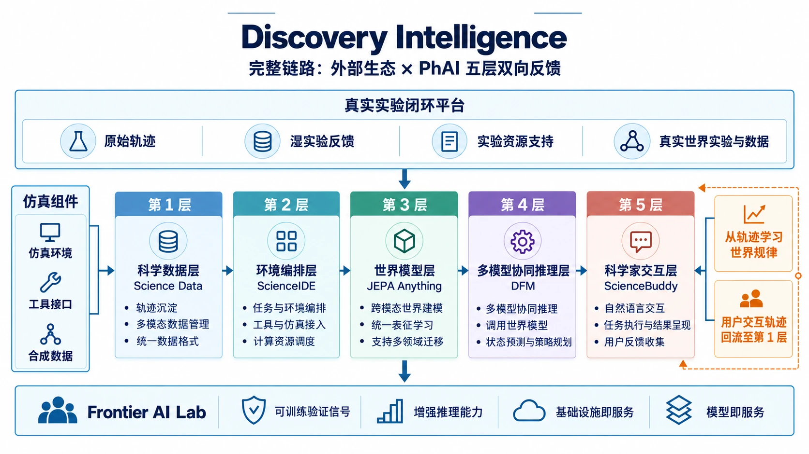
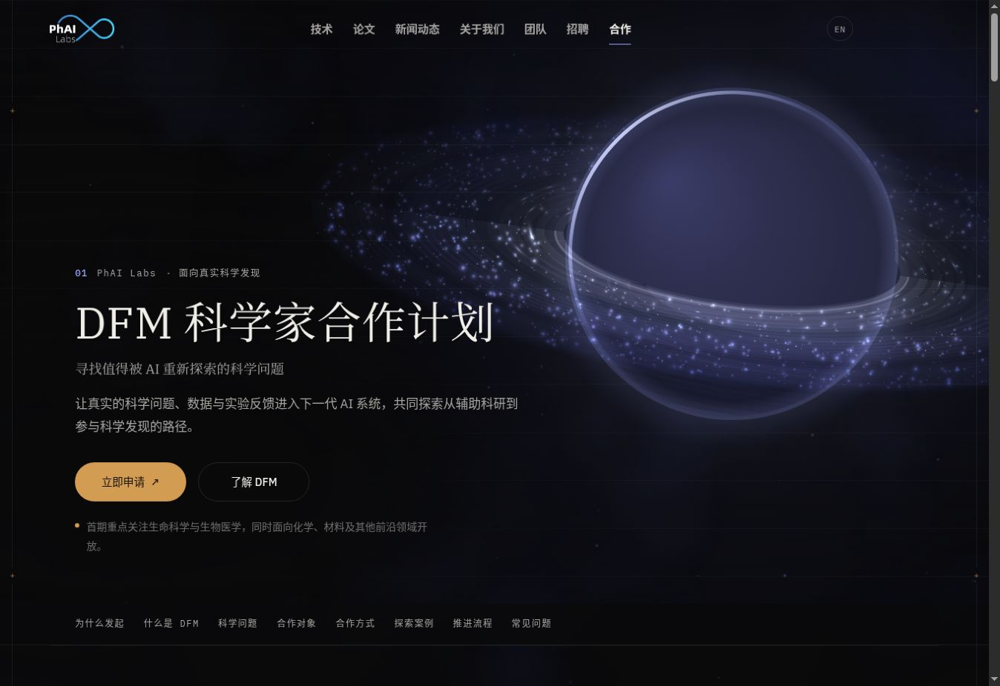

# Discovery Foundation Models

### 发现智能 · 研究与开源

[English](README.md) · **中文** · [官方网站](https://phai-labs.com/) · [技术报告](https://phai-labs.com/papers/dfm/) · [研究项目与进展](#研究项目与进展) · [科学家合作计划](https://phai-labs.com/collaborate/)

**从回答问题、执行任务，走向发现有价值的未知。**

Discovery Foundation Models（DFMs）探索 AI 如何发现问题、形成可研究的问题、构造科学表征与假设、获取外部证据，并在不同任务中持续提升发现能力。

本仓库由 **[PhAI Labs](https://phai-labs.com/)** 发起，汇总 DFM 技术报告、研究版图、成果介绍与开放研究入口。**各项研究工作将在独立 GitHub 仓库中开发和发布；DFM-Plans 负责汇总、里程碑更新与项目导航。**

  

*发现智能架构：连接外部实验、五层协同与闭环反馈。*

## 技术报告

**[Discovery Foundation Models](https://phai-labs.com/papers/dfm/)** — 技术报告。

报告提出七项核心能力：**问题发现、问题形成、表征构造、假设形成、干预与实验、证据驱动的修正，以及跨任务的持续发现能力提升。**

参考架构 **Zetema** 探索如何通过显式研究状态、记忆、科学工具、实验环境、验证机制和人类监督，组织递归发现循环。它是一套研究设计；具体实现与验证进展将通过各项独立研究持续更新。

## 研究项目与进展

从 **Chat** 到 **Code**，再到 **Discovery Intelligence**，AI 的学习经验从已有知识扩展到行动反馈，进一步进入科学研究过程。我们围绕支撑这一转变的科学数据、环境与反馈，推进三个具体项目：

| 方向 | 项目 | 研究重点 | 计划介绍日期 | 项目入口 |
| --- | --- | --- | --- | --- |
| **科学家交互** | **ScienceBuddy** | 科学家对话、研究反馈与持续改进 | 2026 年 9 月 16 日 | [Overview](https://phai-labs.com/papers/) · Code: Coming Soon |
| **科学环境** | **ScienceIDE** | 可执行、可验证、可复用的科学环境，支持 Agent 执行与模型训练 | 2026 年 9 月 17 日 | [Overview](https://phai-labs.com/papers/) · Code: Coming Soon |
| **科学世界模型** | **JEPA Anything** | 跨领域科学状态表征与干预后的状态变化预测 | 2026 年 9 月 18 日 | [Overview](https://phai-labs.com/papers/) · Code: Coming Soon |

三个项目围绕**交互反馈、可复用环境与世界状态预测**展开，共同服务于 DFM 的研究目标，各自独立开发、评测和发布。科学数据与发现推理贯穿其中。

**当前状态**：三个仓库待公开。以上为成果介绍计划；论文、代码、模型、数据、Demo 与后续里程碑将在此统一更新，具体技术文档由各自项目仓库维护。

## 科学家合作计划

  

欢迎拥有重要开放问题、专业数据、可执行环境或真实实验验证条件的科学家、研究团队与实验平台参与合作。

- **[申请加入 DFM 科学家合作计划](https://ecnxosgyafi8.feishu.cn/wiki/Z1A2wr23ViqAOBkq3xfcgfl7nZg?table=tblboSz1SkRQ0iM2&view=vewoiUIlNk)**
- **[DFM 科学家合作计划介绍](https://phai-labs.com/collaborate/)**

## 开发者导航与索引维护

- 代码、安装说明、技术问题、Issue 与贡献方式，请前往对应项目的独立仓库。
- 如需推荐收录项目、纠正链接或讨论整体研究版图，请使用[本仓库 Issues](https://github.com/Gen-Verse/DFM-Plans/issues)。
- 提交索引或里程碑更新，请参阅 [贡献指南](CONTRIBUTING_CN.md)。

## 引用与联系

研究使用请引用相关技术报告或具体项目论文，引用信息将随对应资源上线后补充。

**PhAI Labs** · [官方网站](https://phai-labs.com/) · [yang@phai-labs.com](mailto:yang@phai-labs.com)
